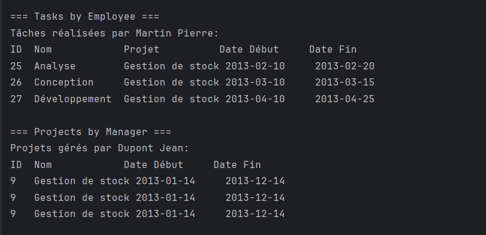
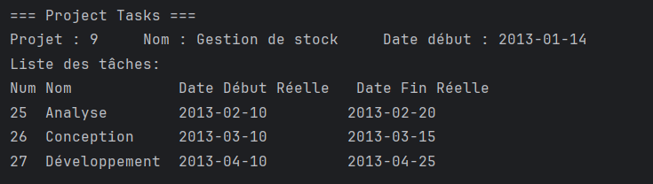
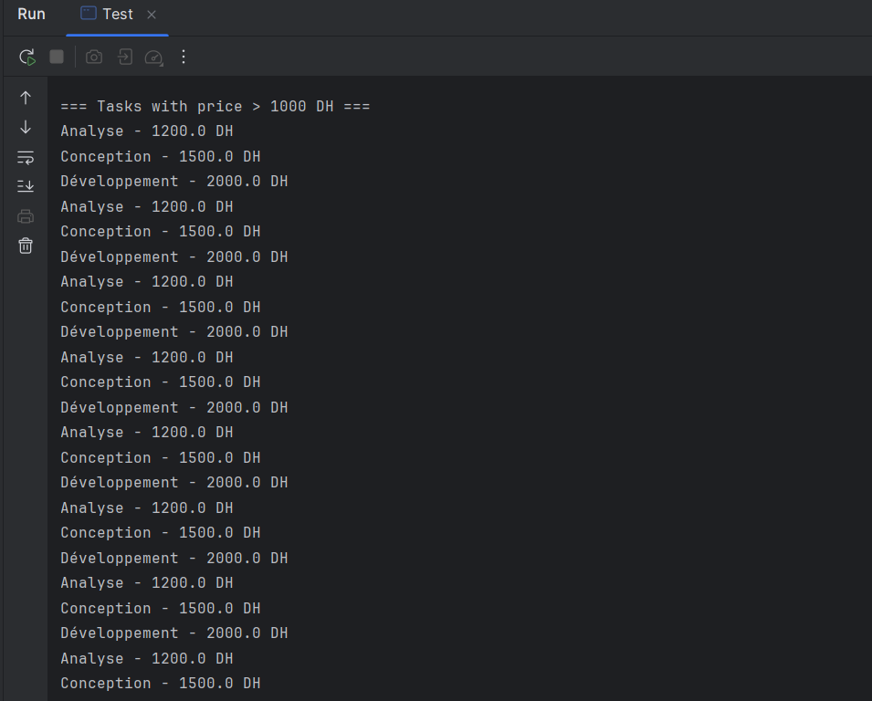
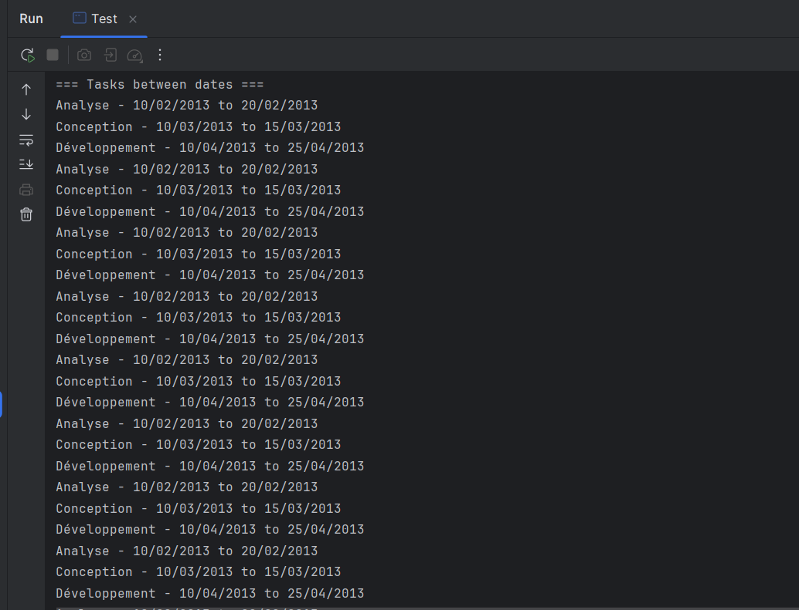

# Gestion des Projets

Application de gestion des projets, employés et tâches utilisant Java, Hibernate et MySQL.

## Captures d'écran

### 1. Liste des Tâches par Employé

_Vue détaillée des tâches assignées à chaque employé avec leurs projets et dates_

### 2. Projets par Chef de Projet

_Affichage des projets gérés par chaque chef de projet_

### 3. Tâches du Projet

_Liste des tâches pour chaque projet avec leurs dates de début et de fin réelles_

### 4. Tâches par Prix

_Vue des tâches filtrées par prix (> 1000 DH)_

## Technologies Utilisées

- Java 21
- Hibernate 5.6.5
- MySQL 8.0
- Maven

## Fonctionnalités

- Gestion des employés
- Gestion des projets
- Gestion des tâches
- Attribution des tâches aux employés
- Suivi des dates de début et de fin
- Gestion des coûts des tâches
- Rapports et statistiques
